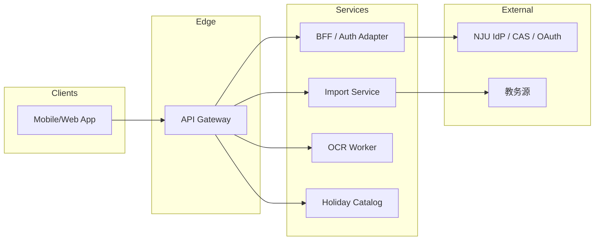

# 后端设计说明（与前端衔接，无代码）

本文档描述 **可选 / 分期启用** 的后端能力边界，使客户端在保留「本地为真源」的前提下，仍能安全接入 **教务导入、OCR、节假日数据、（远期）云同步**。不写具体代码与框架版本；字段语义须与 `data-and-state-contract.md`、`frontend-data-and-state-contract.md` 对齐。

**与产品现状的关系**：`requirements document.md` 当前以 **单机 + 本地备份** 为主；后端定位为 **增强型服务**，不替代用户对课表数据的最终控制权，除非产品明确进入「云端真源」阶段。

---

## 1. 设计目标与非目标

| 目标 | 非目标 |
| --- | --- |
| 为教务统一认证后的课表拉取提供**受控、可审计**的通道 | 在 MVP 阶段强制所有用户数据上云 |
| 为 OCR 提供**异步、可重试**的解析管道 | 在服务端长期存储用户课表全量快照（除非进入阶段 B） |
| 输出与前端 `Course` / `CourseDraft` **同构**的 DTO，减少适配层分叉 | 实现课程社区、IM 等社交能力 |
| 统一错误码、鉴权、限流，便于多端共用 | 绑定特定云厂商专有 API（文档保持厂商无关） |

---

## 2. 分期架构总览

### 2.1 阶段 A（推荐首启）：「导入网关 + 无状态业务」

客户端 **SQLite/IndexedDB 等仍为权威存储**；后端仅提供：

- 南大统一认证 **代理 / 交换**（换取短期会话或一次性导入令牌）。
- 教务课表 **抓取/解析**（或对接校方开放接口，若未来具备），返回 **标准化课程草稿列表**。
- OCR：**上传 → 任务队列 → 结果回调或轮询**，返回课程草稿。
- （可选）**公共节假日**只读数据集（按年/地区版本化）。

此阶段服务端 **可不持久化** 用户课表实体；仅保留审计所需的最小日志（见 §8）。

### 2.2 阶段 B（长期）：「账户 + 云同步真源」

在 `requirements document.md`「多端与云端」目标落地时引入：

- 用户账户体系、设备列表、端到端加密或字段级加密策略（需单独安全评审）。
- **变更向量 / 同步协议**（如按实体 `id` + `updatedAt` + 删除墓碑）。
- 附件对象存储与元数据表。

**本文后续 API 以阶段 A 为主**；阶段 B 在 §11 列出扩展点。

---

## 3. 逻辑架构（组件）

- **API Gateway**：TLS 终结、请求 ID、限流、WAF 挂钩位。
- **BFF / Auth Adapter**：与统一认证对接；**不**向客户端下发教务 Cookie 明文长期存储。
- **Import Service**：将教务 HTML/JSON 转为 **CourseDraft[]**；可插拔「解析器版本」。
- **OCR Worker**：CPU/GPU 或第三方 API；任务与网关解耦。
- **Holiday Catalog**：静态或定期同步的只读数据；带 `datasetVersion`。

---

## 4. 与前端的契约对齐

### 4.1 实体映射（服务端 DTO ↔ 客户端）

| 客户端概念（见 `data-and-state-contract.md`） | 服务端阶段 A 是否持久化 | 典型 DTO 角色 |
| --- | --- | --- |
| `Course` | 否（由客户端写入本地） | `CourseDraft` / `CoursePatch` 仅用于传输 |
| `Timetable` | 否 | 导入时可带 `targetTimetableId`（客户端生成 UUID） |
| `ExamHomework`、`Todo`、`Log` | 否 | 阶段 A 不经后端 |
| `CalendarMark`（用户） | 否 | 阶段 A 不经后端 |
| `Attachment` | 否（阶段 B 走对象存储） | 阶段 A 仍本地文件 |

**CourseDraft（导入响应最小集）** — 字段名宜与前端 `Course` 对齐，便于 `merge`：

- `clientTempId?`（可选，便于 UI 去重）
- `title`, `teacher?`, `room?`, `weekday`, `periodStart`, `periodEnd`
- `weekPattern`（与前端同一 JSON 结构约定）
- `showOnGrid`（默认 `true`；网课场景可由规则或用户后续改）
- `colorHint?`（服务端可不给，由客户端配色引擎生成）
- `sourceMeta`：`{ parserVersion, rawFingerprint }` 便于排错

### 4.2 写入责任边界

| 操作 | 阶段 A 谁写入「真源」 |
| --- | --- |
| 用户编辑课表、待办、日志 | **仅客户端** |
| 教务导入 | 服务端返回草稿 → **客户端确认合并**后写入本地 |
| OCR 导入 | 同上 |
| 节假日展示 | 客户端可缓存服务端 `HolidayDay[]`，与本地日历合成 |

---

## 5. 认证与会话

### 5.1 原则

- 不在自家 DB 存用户教务密码。
- 客户端持 **`app_session`**（自有 JWT 或 opaque token，短期）调用除「登录启动」外的接口。
- 教务侧会话仅在 **Import Service内存或加密 Redis** 中短期存在，用于单次拉取或短窗口重试。

### 5.2 推荐流程（概念）

1. `POST /v1/auth/nju/login/start` → 返回 `authorizationUrl` 或嵌入式 WebView 所需参数。
2. 用户在 IdP 完成登录；BFF **交换** 得到教务访问所需凭证（实现依赖校方机制）。
3. `POST /v1/auth/nju/login/complete`（带 `state` /授权码）→ 下发 **`app_session`**（仅标识「本 App 用户」，阶段 A 可无用户表，仅匿名 UUID + 设备指纹可选）。
4. 后续 `POST /v1/import/jwc` 在 `Authorization: Bearer <app_session>` 下执行。

**阶段 B** 再引入正式 `userId`、刷新令牌、设备撤销。

---

## 6. HTTP API 纲要（REST 风格，无代码）

基址：`https://api.example.edu/nju-timetable/v1`（示例）。所有响应宜包装 **统一信封**（§7）。

### 6.1 认证

| 方法 | 路径 | 请求要点 | 响应要点 |
| --- | --- | --- | --- |
| POST | `/auth/nju/login/start` | `redirectUri`, `clientNonce` | `state`, `authorizationUrl` |
| POST | `/auth/nju/login/complete` | IdP 回调参数 | `appSession`, `expiresIn` |
| POST | `/auth/session/refresh` | 旧 `appSession` | 新 token（阶段 B） |

### 6.2 教务导入

| 方法 | 路径 | 请求要点 | 响应要点 |
| --- | --- | --- | --- |
| POST | `/import/jwc` | `semesterHint?`, `targetTimetableId`, `options`（是否覆盖同名课等由**客户端**定义策略，服务端只负责拉取） | `courses: CourseDraft[]`, `warnings[]`, `parserVersion` |
| GET | `/import/jwc/status` | 若拉取慢可异步（可选） | `jobId` / `done`（可选实现） |

**语义**：服务端 **不** 自动调用客户端本地 DB；合并策略（覆盖、追加、按节次匹配）**前端实现**，以保持「本地真源」。

### 6.3 OCR 导入

| 方法 | 路径 | 请求要点 | 响应要点 |
| --- | --- | --- | --- |
| POST | `/import/ocr/jobs` | `image`（multipart）或 `imageUrl`（内网）、`weekRange`, `timezone` | `jobId` |
| GET | `/import/ocr/jobs/{jobId}` | — | `status`, `progress`, `result?`（含 `CourseDraft[]`） |

失败时返回可本地化 `errorCode`（§7）。

### 6.4 公共节假日（可选）

| 方法 | 路径 | 响应要点 |
| --- | --- | --- |
| GET | `/catalog/holidays?region=CN&year=2026` | `days[]: { date, name, type }`, `datasetVersion` |

客户端用 `datasetVersion` 决定否刷新缓存；与需求中「只读假期、擦除前确认」一致。

---

## 7. 错误与版本约定

### 7.1 响应信封（建议）

- `success: boolean`
- `data: …`（成功时）
- `error: { code, message, details?, requestId }`（失败时）

### 7.2 错误码（示例分类）

| `code` 前缀 | 含义 |
| --- | --- |
| `auth.*` | 未登录、令牌过期、IdP 拒绝 |
| `import.jwc.*` | 教务结构变更、无课表、频率限制 |
| `import.ocr.*` | 图像无法识别、任务超时 |
| `validation.*` | 参数不合法 |

客户端应对 `import.*` 提供 **可重试** 与 **人工反馈入口**（对齐 `frontend-functional-spec.md` 错误约束）。

### 7.3 API 版本

- URL 前缀 `/v1`；**破坏性变更**升 `v2`，旧版保留过渡期。
- `CourseDraft` 增加字段须 **向后兼容**；解析器升级用 `parserVersion` 区分。

---

## 8. 安全与合规

- **传输**：TLS 1.2+；HSTS。
- **日志**：禁止完整打印课表正文；可记录 `requestId`、`userPseudoId`、返回条数、`parserVersion`。
- **密钥**：IdP client secret、OCR API key 仅存密钥管理器。
- **限流**：按 `appSession` + IP；`/import/*` 单独更严配额。
- **隐私**：阶段 A 若匿名 token，需告知用户「导入过程经服务端中转」；阶段 B 需隐私政策与数据留存周期。

---

## 9. 可观测性与运维

- **指标**：`import_jwc_success_total`, `import_jwc_latency`, `ocr_job_fail_total`。
- **追踪**：`X-Request-Id` 贯穿网关与服务。
- **告警**：教务解析失败率突增、OCR 队列堆积。

---

## 10. 与前端的集成顺序（建议）

1. 客户端抽象 **`ImportProvider` 接口**（`jwc` / `ocr` / `mock` 三实现），与 UI 解耦。
2. 先接通 **`mock` + 本地 JSON**，再换真实网关，避免阻塞界面开发。
3. 导入结果一律走 **「预览 → 用户确认 → 写入 `timetables`」**，与 `data-and-state-contract.md` 事务原则一致。
4. 节假日接口可晚于课表 MVP；日历可先内置离线包，再在线更新。

---

## 11. 阶段 B 扩展点（云同步真源）

若产品确认上云，需追加（仅列能力，不展开实现）：

- `user` / `device` 资源与 **`sync`协议**（推送向量、冲突合并规则）。
- `Attachment` 与对象存储预签名 URL。
- **端到端加密**策略（密钥在客户端，服务端仅存密文）或字段级审计需求。
- **GDPR/个人信息保护法** 合规：导出、删除账号。

上述变更须回写 `requirements document.md` 与两份数据契约文档。

---

## 12. 文档维护

- 若教务/OCR 流程或 DTO 变更：**先** 更新本文与 `data-and-state-contract.md` / `frontend-data-and-state-contract.md`，**再** 改 `prompts.md` 编号条目与 `frontend-functional-spec.md` 中导入相关描述。
- 界面真源仍以 `nju-timetable.pen` 为准；后端不得倒逼 UI 变更，除非产品明确。
